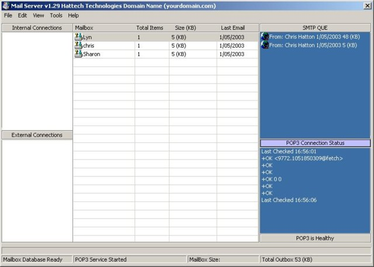



## Mail Server SMTP Direct/Relay into a Access Database \(MDB\)

### Description

UPDATED! Demonstrating the inner workings of the POP3 connectors and SMTP connectors interoperating in separate ActiveX controls, the structure of the protocols are specified from the RFC sections. The SMTP protocol saves all messages into a Microsoft Access Database (MDB) using ADO 2.1, and users can change the code to link a SQL Server database easily enough if need to, which would be handy, as you can publish SQL Servers over the internet for remote access, or replication the emails between to different locations. But for now I have it set up for a centralised database which can be shared for to instances of this mail server for load balancing and network traffic. There are two types of SMTP connectors SMTP Direct and SMTP Relay both are demonstrated and commented.

This is the first release of my mail server and would appreciate any bug findings, I have programmed this in my C:\Exchange directory and no problems found, network drives will cause performance issues and SMTP Spooling errors.

This is a grouped project so remember to open the ExchangeStore.vbg file as it will open the custom controls first.

To get started create a new account in Outlook 2000/Express or any other email client, point the smtp/pop connections to the your development computer and username=chris password=password. Also please VOTE.
 
### More Info
 
Not sure if the smtp spooler works on a win9x machine if not let me know and will fix it.

             |
---                |---
**Submitted On**   |2003-05-02 19:19:04
**By**             |[Chris Hatton](https://github.com/Planet-Source-Code/PSCIndex/blob/master/ByAuthor/chris-hatton.md)
**Level**          |Advanced
**User Rating**    |4.8 (150 globes from 31 users)
**Compatibility**  |VB 6\.0
**Category**       |[Databases/ Data Access/ DAO/ ADO](https://github.com/Planet-Source-Code/PSCIndex/blob/master/ByCategory/databases-data-access-dao-ado__1-6.md)
**World**          |[Visual Basic](https://github.com/Planet-Source-Code/PSCIndex/blob/master/ByWorld/visual-basic.md)
**Archive File**   |[Mail\_Serve158298532003\.zip](https://github.com/Planet-Source-Code/chris-hatton-mail-server-smtp-direct-relay-into-a-access-database-mdb__1-45176/archive/master.zip)

